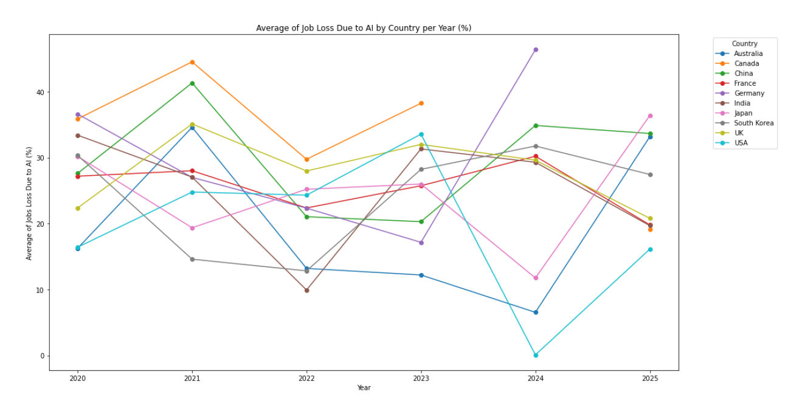

# AI and Digital Markets Analysis

**Author:** Yailin Corona-Ruezga
**Degree Program:** Data Science

---

## Project Overview
This project analyzers trends in AI-generted content across various digital markets and explores relationships between AI adoption, job displacement, industry impacts, and consumer trust. Usind data sourced from Kaggle, the analysis focuses on understanding how increased AI usage mat reshaoe industries and consumer perceptions over time. 

This project was completed as part of DAT301 and refined for portfolio presentation.

---

## Objectives
- Analyze the distribution of AI- generated content across countries
- Examine trends in AI-generated content over time
- Explore the relationship between AI content and job loss across industries
- Investigate consumer trust and human_AI collaboration patterns

---

## Tools and Technology
- **Python**
- **Jupyter Notebook**
- **pandas**
- **matplotlib/seraborn**
- Exploratory data analysis and visualization

---

## Dataset
The dataset used in this project was sourced from Kaggle.

Dataset source and details are documented in:
`data/dataset-link.md`

---

## Repository Structure

ai-digital-markets-analysis/
|-- code/
||-- DAT301-Project2.ipynb
|-- data/
||-- dataset-link.md
|-- outputs/
||-- DAT301-Project2.html
||-- avg_ai_content_country.png
||-- ai_content_over_time.png
||-- industry_ai_vs_job_loss.png
||-- trust_vs_collab.png
|-- README.md

---

## Full Analysis Report
The complete analysis, including the code, visualizations, and interpretation, is available as a rendered HTML report:

**[View full HTML report](outputs/DAT301-Project2.html)**

---

## Selected Visualizations

### Average AI-Generated Content by Country
This chart highlights the differences in AI-generated content levels across countries. The visualization suggets that AI usage is unevenly distributed globally, with certain countries exhibiting higher levels of AI-generated content, which may have been caused by a country's technological infrastructure, regulation, or market demand. 


### Job Loss Trends Over Time by Countries
This time-series visualizatyion tracks changes in job loss over time, offeringinsight into how workforce displacement may be evolving along side increased AI adoption. The trend suggests periods of acceleration and stabilization, emphasizing the importance of temporal context when evaluating the labor impacts of emerging technologies.


### AI Content vs Job Loss by Industry
This scatter plot explores the relationship between AI adoption and reported job displacement across industries. While higher AI adoption is not uniformly associated with increased job displacement, the visual highlights where rising AI usage may coincide with greater workforce impact, suggesting areas for deeper investigation.


### Consumer Trust vs Human-AI Collaboration
An examination of how consumer trust relates to levels of human-AI collaboration. The variations across the observations indicated that collaboration levels may not fully explain trust alone, possibly being affected bythe influence of additional social or organizational factors. 


---

## How to Reproduce This Analysis
1. Review the dataset source in `data/dataset-link.md`
2. Open `code/Dat301-Project2.ipynb` in Jupyter Notebook
3. Install required packages:
4. ```python
   pip install pandas matplotlib seaborn

